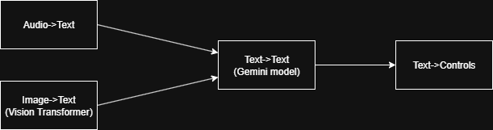

# CARLA Autopilot LLM
A Python program uses a vision transformer model to convert sensor images to text and convert audio files to text to prompt a Gemini model to give directions to the car. 

---

## Screens & Demo  




---

## Important Links
- [Data Generation Repository](https://github.com/SumukhP-dev/Carla-Lane-Detection-Dataset-Generation)
- [Huggingface Image To Text Dataset](https://huggingface.co/datasets/Sumukhdev/carla_image_to_text_dataset)
- [Huggingface Image Captioning Model](https://huggingface.co/Sumukhdev/carla_image_captioning_model)

---

## Features (What You’ll See)  
- A main car will be spawned and will try to navigate traffic without crashing
- There will be multiple lanes and the car will navigate through said lanes to maintain speed

---

## Tech Stack  
- **Language**: Python
- **IDE**: PyCharm

---

## Setup (Run in 2 Minutes)  
1. Clone the repository:  
   ```bash
   git clone https://github.com/SumukhP-dev/CARLA_Autopilot_LLM.git
   ```
2. Install and Start the CARLA simulator
3. Run 
   ```bash
   python simulator.py
   ```

---

## License & Contact  
**License:** MIT  

**Author:** Sumukh Paspuleti
- [LinkedIn](https://www.linkedin.com/in/sumukh-paspuleti/)  
- [Email](mailto:spaspuleti3@gatech.edu)  

